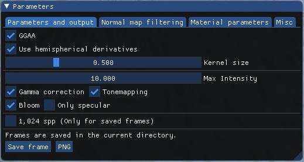
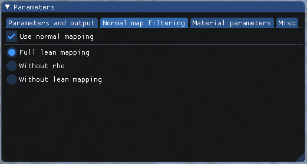
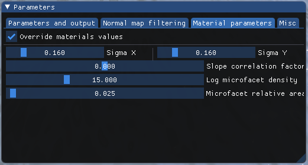
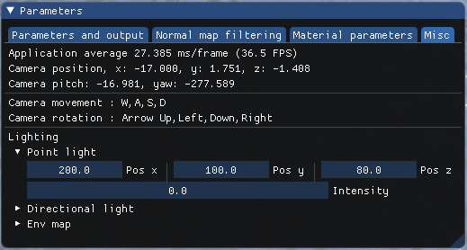

Real-Time Geometric Glint Anti-Aliasing with Normal Map Filtering
==================================================================

The OpenGL implementation of the paper: **Real-Time Geometric Glint Anti-Aliasing with Normal Map Filtering**.

[Xavier Chermain](http://igg.unistra.fr/People/chermain/)
([ICUBE](https://icube.unistra.fr/en/)),
[Simon LUCAS](http://www.simon-lucas.fr)
([ICUBE](https://icube.unistra.fr/en/)), 
[Basile Sauvage](https://igg.icube.unistra.fr/index.php/Basile_Sauvage)
([ICUBE](https://icube.unistra.fr/en/)), 
[Jean-Michel Dishler](https://dpt-info.u-strasbg.fr/~dischler/)
([ICUBE](https://icube.unistra.fr/en/)) and 
[Carsten Dachsbacher](https://cg.ivd.kit.edu/english/dachsbacher/)
([KIT](https://www.kit.edu/english/index.php)).

Accepted for [i3D 2021](http://i3dsymposium.github.io/2021/) and for CFG special issue.

* [Paper](http://igg.unistra.fr/People/chermain/assets/pdf/Chermain2021RealTime.pdf)

Usage
-----

1. Compile and build the project (look at the corresponding
   [Section](#compiling-the-example)).
1. `cd ./<build_dir>/geometric_glint_aa`
1. `./geometric_glint_aa  <scene>`

Scenes
----
* `Arctic`: Figure 1
* `Sponza`: Figure 10 
* `Sphere`: Figure 8 and Figure 9
* `Tubes`: Figure 7
* `Ogre`: Extra


Movement
----

The W, A, S, D and Arrow Up, Left, Down, Right keys control the position and the
orientation of the camera.

Interface
----
##### Parameters and Output

* The GGAA filter can be activated or deactivated and the kernel size can be modified.
* All post-processing effects can be removed independently (bloom, tone mapping,
  gamma correction).
* Specular from the glinty BRDF can be rendered independently.
* Frames can be saved in `.png` or `.exr` file format.
* Reference images can be computed if the button `1,024 spp` is on. *Warning:
  the supersampling  is only done when frames are saved into png or exr files.
  Generated references can't be seen directly in the application.*

##### Normal map filtering

* Normal mapping can be activated or deactivated.
* You can choose to use LEAN mapping or not, as well as using the slope
  correlation factor `rho` or not.

##### Material parameters

* When the checkbox `Override materials values` is on, you can override the
  predefined materials parameters.

##### Miscellaneous

* Display frame rate.
* You can modify the lighting here.

## Contributions

* Contribution 1: Geometric Glint Anti-Aliasing (GGAA),
 `geometric_glint_aa/shader/improved_glint_envmap.frag.glsl`
* Contribution 2: Slope Correlation Factor,
 `geometric_glint_aa/shader/improved_glint_envmap.frag.glsl`

Project structure
-----
The files are organized as follows:

* `geometric_glint_aa`: the folder containing the paper code (CPU and GPU side),
  * `geometric_glint_aa/shader`: folder of the compute, vertex, and fragment
    shaders (GPU),
  * `geometric_glint_aa/scene_obj.*`: the API / CPU part, with the loading of
    the dictionary in an array texture.
* `media`: the data.
  * `media/dictionary`: the dictionary used by Chermain et al. 2020,
  * `media/snow`: the custom scene of an Arctic landscape (with a snowman behind the
    camera),
  * `media/sponza`: [Sponza](https://casual-effects.com/data/),
  * `media/sphere`: the mesh and material of a sphere,
  * `media/silver-snowflake-ornament`: [Silver Snowflake Ornament](http://www.blendswap.com/blends/view/22979),
  * `media/ogre`: [Jerry the Ogre](https://www.cs.cmu.edu/~kmcrane/Projects/ModelRepository/).
* `opengl`: The files of the OpenGL framework.

The OpenGL framework is based on 
[OpenGL 4 Cookbook]
(https://github.com/PacktPublishing/OpenGL-4-Shading-Language-Cookbook-Third-Edition)
and [learnopengl.com](https://learnopengl.com/).

The libraries used in this project are:

* [GLM Mathematics Library][GLM]
* [GLFW][]
* [ASSIMP][]
* [tinyexr][]
* [stb][]
* [Dear ImGui][]
* [GLAD][]

If you modify the ``glsl`` code, don't forget to re-run cmake.

Requirements. Based on readme.md of [OpenGL 4 Cookbook](https://github.com/PacktPublishing/OpenGL-4-Shading-Language-Cookbook-Third-Edition).
-------------
To compile this example, you'll need the following:

* The [GLM Mathematics Library][GLM] version 0.9.6 or later.  Note that versions
  prior to 0.9.6 may not work properly because of a switch from degrees to
  radians.  GLM 0.9.5 will work, but you'll need to add `#define GLM_FORCE_RADIANS`
  prior to including the glm header files.
* [GLFW][] version 3.0 or later.
* [ASSIMP][] version 5.0 or later.

## Compiling the example
The example code builds with [CMake][].

1.  Install [GLFW][] by following the instructions on their [web site][GLFW].
2.  Install the latest version of [GLM][].  Note that for [CMake][] to find GLM
    correctly, you need to run the install "build" (e.g. `make install`) or install GLM from your
    favorite package manager.  Otherwise, the CMake config files will not be created/available.
3.  Install the latest version of [ASSIMP][].
4.  Download this example code, or clone using git.
5.  Run cmake.  If cmake has difficulties finding the GLFW or GLM installations,
    set the variable [`CMAKE_PREFIX_PATH`][cmake_prefix] to help cmake find them.  
    It can be tricky to get CMake to find the GLM libraries, unfortunately.  See
    below for tips.
6.  Compile by running `make`.

Tips for getting CMake to find GLM
-----------------------------------------
When searching for GLM, CMake looks for the files `glmConfig.cmake` and `glmConfigVersion.cmake`.

If you install GLM using a package manager such as Homebrew on macOS, or a Linux package manager the
 cmake files should already be included.  

Otherwise, if you're using the GLM source distribution, you'll have to run GLM through CMake to get it to
generate the `glmConfig.cmake` and `glmConfigVersion.cmake` files.

1.  Download GLM and extract it to some location: `GLM_SRC`
1. `cd $GLM_SRC`
1. `mkdir build`
1. `cd build`
1. `cmake -D GLM_TEST_ENABLE=OFF -D CMAKE_INSTALL_PREFIX=MY_GLM_LOCATION ..`
1. `cmake --build . --target install`

Replace `GLM_SRC` above with the place where you extracted the GLM zip file, and replace `MY_GLM_LOCATION` 
with the location where you want to install GLM. This should generate the needed cmake files and install
all of GLM to `MY_GLM_LOCATION`.

Tips for compiling for Windows with Visual Studio
---------------------------------------------
* Use the Visual Studio target in [CMake][]:  `-G "Visual Studio..."`, open the
  Visual Studio solution. 
* The example code requires a command line argument to choose a scene.  When
  running in VS, be sure to set the 'Command Argument' under 'Properties' for
  the appropriate scene.

Best solution for Windows + Visual Studio User. From [Allen](https://github.com/allenk/OpenGL-4-Shading-Language-Cookbook-Third-Edition/blob/master/README.md).
-----------------------------------------------------
Windows doesn't own a unified folder (/usr/local/lib) to search library. Microsoft provides vcpkg for package management to speed up the development process.

1.  Install [vcpkg](https://github.com/microsoft/vcpkg) (Follow the vcpkg installation instructions [vcpkg document](https://vcpkg.readthedocs.io/en/latest/))
    You can instance a new powershell console and type
```
git clone https://github.com/Microsoft/vcpkg.git
cd vcpkg
PS> .\bootstrap-vcpkg.bat
```    
2.  Install GLM, GLFW and ASSIMP via vcpkg.
```
x64 version:
vcpkg.exe install glfw3:x64-windows
vcpkg.exe install glm:x64-windows
vcpkg.exe install assimp:x64-windows

x86 version:
vcpkg.exe install glfw3
vcpkg.exe install glm
vcpkg.exe install assimp
```
2.  Add VCPKG Toolchain
    -DCMAKE_TOOLCHAIN_FILE=C:/vcpkg/scripts/buildsystems/vcpkg.cmake
    Replace `C:/vcpkg/scripts/buildsystems/vcpkg.cmake` with your VCPKG root.
    After this, CMake could find GLM, GLFW3 and ASSIMP automatically.


Tips for compiling on mac osX
---------------------------------------------
Use [HomeBrew] for dependencies (and cmake).

Tested on MacBookPro 2020 with AMD Radeon Pro 5500M.

OpenGL Function Loading
-----------------------

An OpenGL header file and a function loader for a 4.5 core profile are included
with this project. They were generated using [GLAD][]. This loader should also
work on MacOS under a 4.1 core profile, but of course not all functions will
load.

The code has been tested with:
------------------------------
- Windows 10,
- Linux,
- Mac OS/X,

[GLM]: http://glm.g-truc.net
[GLFW]:  http://glfw.org
[ghcookbook]:  https://github.com/PacktPublishing/OpenGL-4-Shading-Language-Cookbook-Third-Edition
[cookbook]: http://www.packtpub.com/
[GLLoadGen]:  https://bitbucket.org/alfonse/glloadgen/wiki/Home
[CMake]: http://www.cmake.org/
[GLAD]: https://github.com/Dav1dde/glad
[cmake_prefix]: https://cmake.org/cmake/help/latest/variable/CMAKE_PREFIX_PATH.html
[ASSIMP]: https://www.assimp.org/
[tinyexr]: https://github.com/syoyo/tinyexr
[stb]: https://github.com/nothings/stb
[Dear ImGui]: https://github.com/ocornut/imgui
[HomeBrew]: https://brew.sh/index_fr
